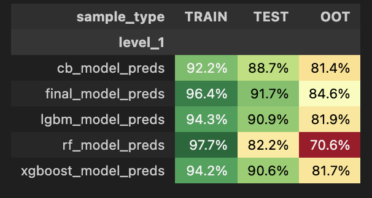
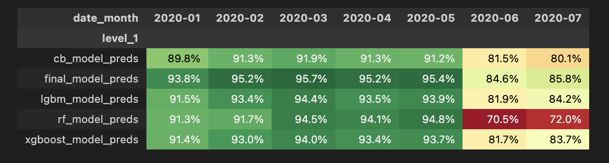
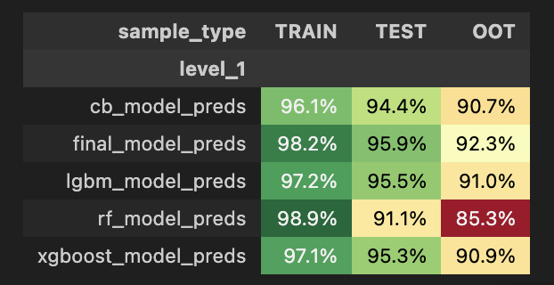
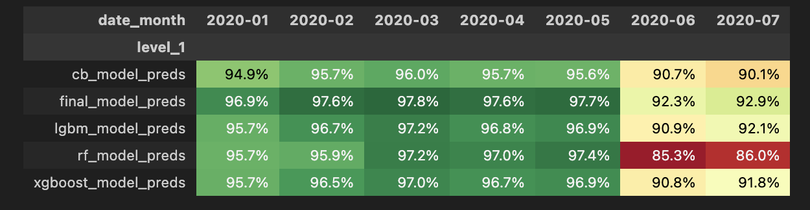
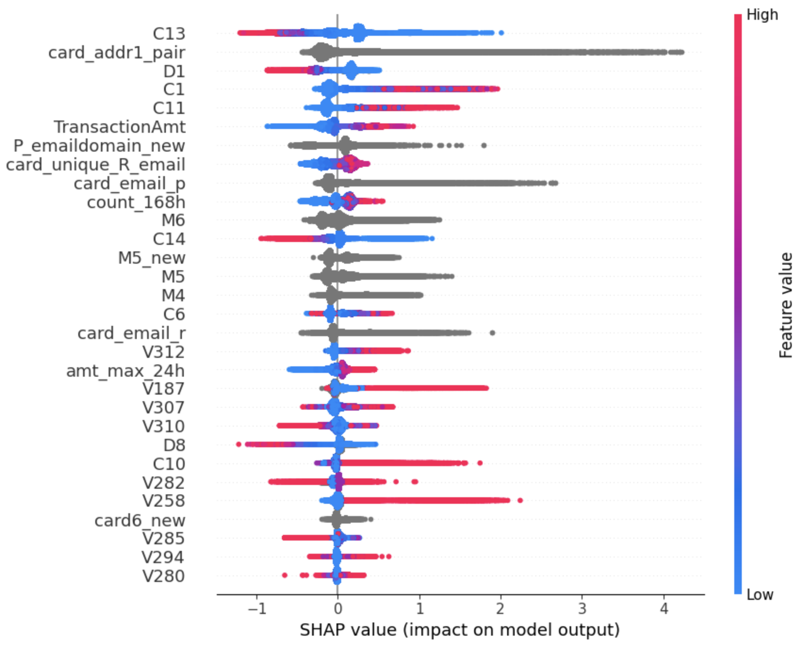
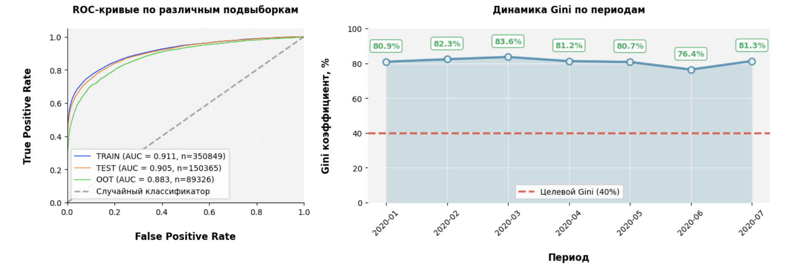

# Отчет по улучшению моделированию

## Работа с признаками
**Файл:** [notebooks/1. Data_preparation.ipynb](../notebooks/1.%20Data_prepararation.ipynb)

1. Работа с категориальными факторами:

    - Произведено укрупнение категорий по ряду показателей: `P/R_emaildomain`, `id_30`, `id_31`, `DeviceInfo`. `id_33` - рассчитаны соотношения сторон по данным ширины/высоты дисплеев устройств.
    - Cозданы новые факторы, где пропуски заполнялись новой категорией (`'missing'`)
Цель - произвести объединение по идентичности -> на выходе иметь меньше категорий.

2. Создание признаков на основе агрегации сумм транзакций по картам с использованием временных периодов. Для каждого временного окна рассчитываются суммы, средние, минимумы, максимумы, отношения и т.д. по каждой карте.
Цель - выявление временных паттернов для обнаружения мошенничества.

3. По аналогии с п.2, но без использования временных периодов. + добавление новых показателей и комбинация с другими факторами (например доля ночных транзакций, смена адресов, флаги транзакций в выходные дни)

## Обучение нелинейных моделей
**Файл:** [notebooks/3.2 Nonlinear_models.ipynb](../notebooks/3.2%20Nonlinear_models.ipynb)

1. Добавлены различные виды бустингов - `Catboost`, `Xgboost`, `Lightgbm`

2. Добавлено обучение Random Forest.

3. Для каждой нелинейной модели:
    - Добавлено время обучения модели
    - Проведен отбор гиперпараметров с помощью `optuna`.
    - Выведены финальные таблицы с проведенными экспериментами по всем обученным моделям в разрезе sample  по метрикам `gini`, `roc_auc_score`, `precision`, `recall`

## Сравнительный анализ моделей

**Лучшие модели по качеству:**
1. **CatBoost (final_model_preds)** — показал наилучшую обобщающую способность как на TEST, так и на OOT выборках. Значение GINI на TEST составило **91.7%**, на OOT — **84.6%**, что является максимальным среди всех моделей.
2. **LightGBM** — продемонстрировал высокое качество (GINI на TEST — 90.9%, ROC-AUC — 95.5%), уступив только CatBoost, и показал хорошую стабильность на OOT.
3. **XGBoost** — показал сопоставимые с LightGBM результаты (GINI на TEST — 90.6%, ROC-AUC — 95.3%), но незначительно уступил по метрикам на OOT.
4. **Random Forest** — продемонстрировал высокое качество на обучающей выборке (GINI — 97.7%, ROC-AUC — 98.9%), но значительно переобучился, о чем свидетельствует резкое падение метрик на TEST (GINI — 82.2%) и OOT (GINI — 70.6%).

**Динамика метрик (финальная модель CatBoost vs базовая логистическая регрессия):**
- Прирост **GINI на TEST** относительно базовой логистической регрессии составил **+8.9 п.п.** (с 82.8% до 91.7%).
- Прирост **GINI на OOT** составил **+3.5 п.п.** (с 81.1% до 84.6%).
- Прирост **ROC-AUC на TEST** составил **+13.1 п.п.** (с 82.8% до 95.9%).
- Прирост **ROC-AUC на OOT** составил **+11.2 п.п.** (с 81.1% до 92.3%).

**Время обучения моделей**
| Модель | Время обучения (сек) |
|--------|---------------------|
| **CatBoost** | **29.38** |
| LightGBM | 40.16 |
| XGBoost | 47.30 |
| Random Forest | 179.61 |

**Короткий вывод по времени обучения:**
CatBoost показал наилучший результат не только по качеству прогнозирования, но и по скорости обучения — 29.4 секунды, что в 1.4 раза быстрее LightGBM, в 1.6 раза быстрее XGBoost и в 6 раз быстрее Random Forest. Такое сочетание высокой обобщающей способности и эффективной скорости обучения делает CatBoost оптимальным выбором для внедрения в production-среду.

**Результаты в таблицах по основным метрикам:**

**GINI:**

**ROC-AUC:**

## Анализ финальных переменных

**SHAP-values**:

Метрики CatBoost модели, взятые из предыдущего чекпоинта без генерации дополнительных фичей:

Прирост метрики качества **ROC-AUC** составил порядка 6-7 п.п на периоде **TRAIN** и **TEST**, на **OOT** - на 4 п.п

Список новых переменных, зашедших в модель:
- amt_max_24h
- count_168h
- card_addr1_pair
- card_email_p
- card_email_r
- card6_new
- M5_new
- P_emaildomain_new
- card_unique_R_email

## Бизнес-обоснование

Наиболее важные переменные, а также их описание и обоснование их важности приведены далее:

- `C13` — Счётчик уникальных email'ов / устройств, привязанных к карте.

    Важна потому что: у нормального пользователя значение стабильно, резкий рост означае, что карту тестируют с разных email (классический фрод).

- `card_addr1_pair` — Связка «карта + адрес».

    Важна потому что: Мошенник использует одну карту с разных адресов или много карт с одного адреса. Модель ловит нарушение привычного графа связей.

- `D1` — Время с прошлой транзакции.

    Важна потому что: Мошенники делают паузу (карта украдена, ждёт), потом серию быстрых транзакций. Модель видит сбой ритма.

- `C1` — Количество предыдущих транзакций по карте.

    Важна потому что: У новой скомпрометированной карты истории мало, но мошенник может маскироваться. Несоответствие с суммой (TransactionAmt большой, а C1 маленький) — красный флаг.

- `C11` — Количество уникальных стран/городов по карте за период.

    Важна потому что: Человек физически не может за 2 часа сделать покупку в Москве, Лондоне и Токио. Скорее всего, карта вбивается вручную через разные прокси

- `TransactionAmt` — Сумма транзакции.

    Важна потому что: сама по себе слаба, но в комбинациях — выброс в 100× от обычного чека или несоответствие стране/времени — ключевой сигнал фрода.
