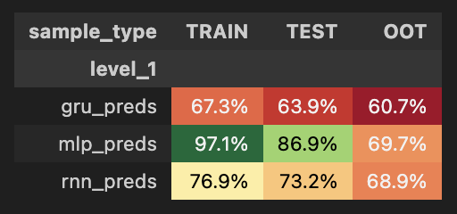
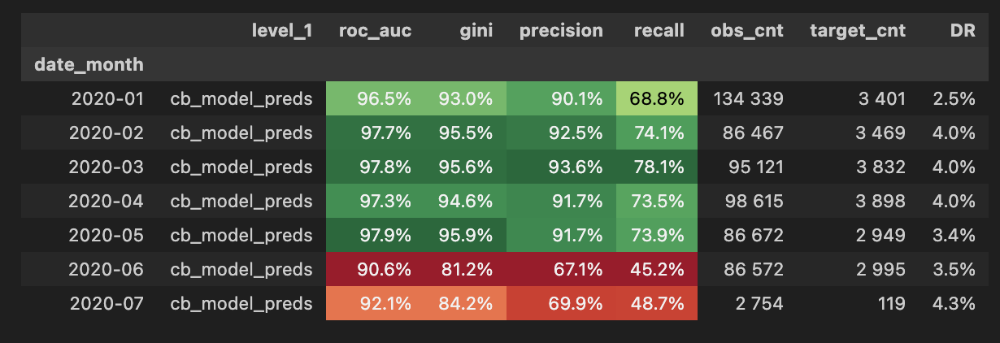

## Обучение DL моделей
**Файлы:**
[notebooks/4.1 MLP_model.ipynb](../notebooks/4.1.%20MLP_model.ipynb)
[notebooks/4.2 DL_RNN.ipynb](../notebooks/4.2.%20DL_RNN.ipynb)
[notebooks/4.3.2. GRU_model.ipynb](../notebooks/4.3.2.%20GRU_model.ipynb)

1. Обучено 3 архитектуры глубокого обучения:
   - **MLP** — многослойный перцептрон
   - **RNN** — рекуррентная нейронная сеть
   - **GRU** — сеть с управляемыми рекуррентными блоками

2. Для каждой модели:
   - Проведено обучение на исторических данных
   - Выполнена оценка качества на трех выборках: TRAIN, TEST, OOT
   - Рассчитана метрика GINI

**Результаты метрик GINI:**

| sample_type | TRAIN | TEST | OOT |
|-------------|-------|------|-----|
| **gru_preds** | 67.3% | 63.9% | 60.7% |
| **mlp_preds** | 97.1% | 86.9% | 69.7% |
| **rnn_preds** | 76.9% | 73.2% | 68.9% |

**Ключевые наблюдения:**
- **MLP** показал наилучший результат на TRAIN (97.1%) и TEST (86.9%), однако демонстрирует значительное переобучение — падение GINI на OOT до 69.7%
- **RNN** занял второе место по качеству на TEST (73.2%), показав при этом более стабильную динамику на OOT (68.9%)
- **GRU** показал наименьшие метрики на всех выборках, уступив другим архитектурам

## Интеграция DL предсказаний в CatBoost
**Файл:** [notebooks/5. DL_comparsion.ipynb](../notebooks/5.%20DL_comparsion.ipynb)

1. Предсказания трех DL моделей добавлены как дополнительные признаки в CatBoost
2. Проведено сравнение метрик финальной модели CatBoost с учетом их добавления

**Сравнение метрик CatBoost до/после добавления DL предсказаний:**

| date_month | Метрика | Без DL (gini) | С DL (gini) | Динамика |
|------------|---------|---------------|-------------|----------|
| 2020-01 | final_model_preds | 93.8% | 93.0% | -0.8 п.п. |
| 2020-02 | final_model_preds | 95.2% | 95.5% | +0.3 п.п. |
| 2020-03 | final_model_preds | 95.7% | 95.6% | -0.1 п.п. |
| 2020-04 | final_model_preds | 95.2% | 94.6% | -0.6 п.п. |
| 2020-05 | final_model_preds | 95.4% | 95.9% | +0.5 п.п. |
| 2020-06 | final_model_preds | 84.6% | 81.2% | -3.4 п.п. |
| 2020-07 | final_model_preds | 85.8% | 84.2% | -1.6 п.п. |

## Выводы по DL моделям и их влиянию

**По качеству DL моделей:**
1. **MLP** — лидер по метрикам на TRAIN и TEST, но демонстрирует переобучение (падение GINI на OOT составило 17.2 п.п. относительно TEST)
2. **RNN** — стабильная модель с умеренным переобучением (разрыв GINI TEST-OOT — 4.3 п.п.)
3. **GRU** — показал слабейшие результаты, разрыв GINI TEST-OOT минимален (3.2 п.п.), что говорит о хорошей обобщающей способности, но низком качестве в целом

**Влияние DL предсказаний на CatBoost:**
- Добавление DL предсказаний **не привело к значимому улучшению** метрики GINI в большинстве периодов
- Зафиксировано **негативное влияние** на GINI в периоды 2020-06 (-3.4 п.п.) и 2020-07 (-1.6 п.п.)

**Итоговый вывод:**
Добавление DL предсказаний не улучшает дискриминационную способность модели по метрике GINI, а в отдельных периодах приводит к её снижению. Базовая версия CatBoost без DL признаков показывает более стабильные результаты по GINI.
